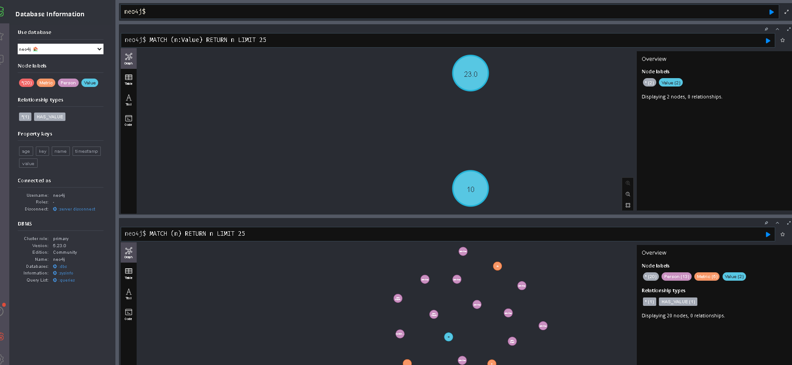
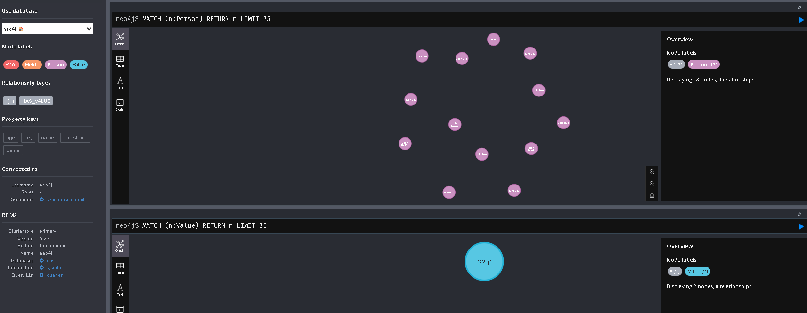
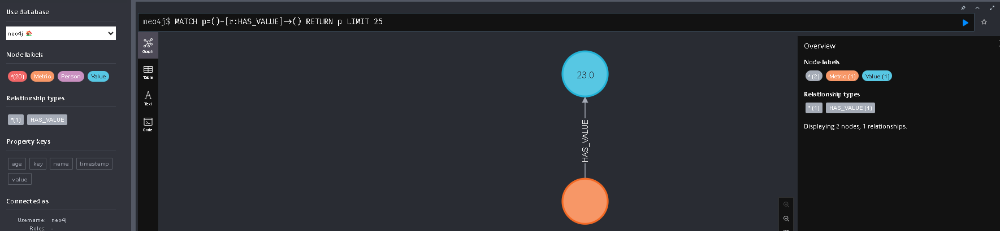

# README

## Descripción del Proyecto

Este proyecto implementa un **servicio de API** ligero para **registrar y reportar métricas**, utilizando **Ruby on Rails** como framework y **Neo4j** como base de datos. Este servicio expone tres endpoints que permiten:
1. **POST /metric/:key**: Registrar un valor de métrica para una clave específica.
2. **DELETE /metric/:key**: Eliminar todas las métricas asociadas con una clave.
3. **GET /metrics**: Recuperar métricas agregadas para la última hora.

Este proyecto se diseñó para manejar datos de métricas de forma eficiente, aprovechando las capacidades de bases de datos orientadas a grafos como Neo4j y utilizando la gema `httparty` para realizar solicitudes HTTP de manera efectiva.

---

## Tecnologías Utilizadas

### 1. **Ruby on Rails (v7.0.8.4)**
   - **Propósito**: Rails es un framework MVC completo que facilita la construcción de aplicaciones web robustas. En este proyecto, Rails se utiliza para estructurar la API REST, gestionar las rutas y manipular las interacciones con la base de datos.
   - **Características**: Rails incluye características como generación automática de rutas RESTful, validaciones a través de ActiveModel, y la separación del código en controladores y modelos para mantener la estructura ordenada.
   - **Versión**: 7.0.8.4

### 2. **Neo4j (Base de Datos)**
   - **Propósito**: Neo4j es una base de datos orientada a grafos que permite gestionar relaciones complejas de manera eficiente. En este proyecto, se utiliza para almacenar y recuperar métricas, beneficiándose de su alto rendimiento en consultas de grafos.
   - **Conexión**: Se utiliza la gema `neo4j-ruby-driver` para establecer la conexión entre la aplicación Rails y Neo4j.
   - **Configuración**: Se requiere tener una instancia de Neo4j corriendo localmente con el protocolo **Bolt**.
   - **Versión**: `~> 4.4`

### 3. **HTTPARTY**
   - **Propósito**: `httparty` es una gema que facilita la realización de solicitudes HTTP desde una aplicación Rails. En este proyecto, se podría usar para interactuar con APIs externas o para realizar peticiones dentro de la misma aplicación.
   - **Versión**: Se especifica en el Gemfile.

### 4. **Puma (Servidor Web)**
   - **Propósito**: Puma es el servidor web que gestiona las solicitudes HTTP hacia la aplicación Rails. Está diseñado para manejar alta concurrencia y es ideal para aplicaciones ligeras como esta.
   - **Versión**: `~> 5.6.8`

### 5. **Bootsnap**
   - **Propósito**: Mejora los tiempos de arranque de la aplicación Rails al cachear ciertos procesos y hacer el entorno de desarrollo más rápido y eficiente.
   - **Uso**: Bootsnap se utiliza solo en desarrollo para mejorar la experiencia del programador.

---

## Instrucciones de Configuración

### Requisitos Previos

- **Ruby**: Se requiere tener instalado **Ruby 3.3.4** o superior.
- **Rails**: Se debe instalar Rails en su versión **7.0.8.4**.
- **Neo4j**: Debes tener instalado Neo4j en tu máquina local o configurarlo en un servidor remoto. Asegúrate de tenerlo corriendo en el puerto **7474** con el protocolo **Bolt**.

### Pasos para Configuración

1. **Clonar el Repositorio**
   ```bash
   git clone https://github.com/systemadminlightinnoivationsla/grillo_tech_ch3
   
   ```

2. **Instalar las Dependencias**
   Utiliza Bundler para instalar las gemas especificadas en el Gemfile:
   ```bash
   bundle install
   ```

3. **Configuración de Neo4j**
   Modifica el archivo `config/application.rb` para añadir la configuración de Neo4j:
   ```ruby
   config.neo4j.session.url = 'http://localhost:7474'
   config.neo4j.session.authentication = Neo4j::Driver::AuthTokens.basic('neo4j', 'tu_password')
   ```

4. **Iniciar el Servidor Rails**
   Ejecuta el siguiente comando para iniciar el servidor Rails:
   ```bash
   rails server
   ```

5. **Iniciar Neo4j**
   Asegúrate de que el servidor Neo4j está corriendo. Puedes iniciarlo con:
   ```bash
   neo4j console
   ```

---

## Endpoints de la API

### 1. **Registrar Métrica (POST /metric/:key)**
   - **Descripción**: Registra una nueva métrica asociada a una clave.
   - **Parámetros**: 
     - `key` (en la URL): la clave de la métrica.
     - `value` (en el cuerpo): el valor de la métrica.
   - **Ejemplo cURL**:
     ```bash
     curl -X POST http://localhost:3000/metric/test_key -H "Content-Type: application/json" -d '{"value": 23}'
     ```

### 2. **Eliminar Métrica (DELETE /metric/:key)**
   - **Descripción**: Elimina todas las métricas asociadas a una clave específica.
   - **Parámetros**: 
     - `key` (en la URL): la clave de la métrica.
   - **Ejemplo cURL**:
     ```bash
     curl -X DELETE http://localhost:3000/metric/test_key
     ```

### 3. **Obtener Métricas (GET /metrics)**
   - **Descripción**: Recupera todas las métricas agregadas durante la última hora.
   - **Ejemplo cURL**:
     ```bash
     curl http://localhost:3000/metrics
     ```

---

## Pruebas y Testeo

1. **RSpec**
   - Se utiliza **RSpec** para pruebas unitarias y de integración. Puedes ejecutar las pruebas con:
     ```bash
     bundle exec rspec
     ```

2. **Pruebas Manuales**
   - Los ejemplos de cURL proporcionados arriba se pueden utilizar para realizar pruebas manuales en los endpoints.

---

## Despliegue

Para el despliegue de esta aplicación en un entorno de producción, asegúrate de tener configurados los siguientes aspectos:
- **Base de datos Neo4j**: Asegúrate de que tu servidor de producción tenga acceso a una instancia de Neo4j.
- **Variables de entorno**: Configura las credenciales y la URL de Neo4j utilizando variables de entorno en tu servidor de producción.

--- 

## Testing local



